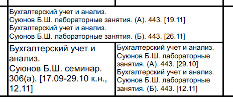
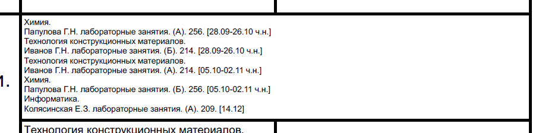
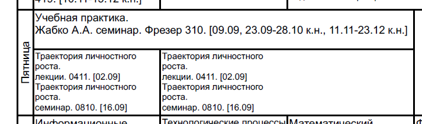
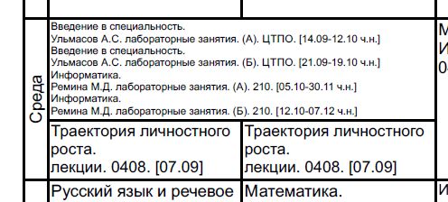

# StankinScheduleEditor3

**StankinScheduleEditor3** - парсер расписания напрямую из PDF файла (минуя процесс распознавания как в 
StankinScheduleEditor 1 и 2)

## Преимущества и недостатки

#### Достоинства

- Скорость работы (парсинг ~90 расписаний / секунду)
- Легкость установки и работы (из зависимостей только PyMuPDF)

#### Недостатки

- Невозможность парсинга расписаний с фото (начиная с 2021 пока еще снова не встречались)

## Проблема неправильного определения длины пары

Из-за оптимизаций в самом PDF файле, а также особенностей программы его формирования, возможны
проблемы в определении длительности. Область (bound прямоугольник) текста не всегда соответствует
границам ячеек, из-за чего парсинг посредством определения продолжительности занятия, основанного на разности 
границ текста (bound прямоугольник) и верхней шапки с временем (8:30-10:10 и т.д.), может быть не корректен.
Большая часть этих проблем решаются посредством применения `duration_fixer`,
но не **ВСЕ**. 

Алгоритм `duration_fixer` (взят с логики парсинга `rector-schedule-parser`):
- все лабораторные работы имеют фиксированную длину 2
- все лекции и семинары имеют фиксированную длину 1
- только пары "Учебная практика" имеют длину 3

После данной обработки остаются ~5-10 занятий на ~230 расписаний с неправильными диапазонами.
Число приблизительное, но после сравнения с работой StankinScheduleEditor2, где область ячеек текста
распознается посредством OpenCV, вышло примерно так.

| Примеры, где могут возникнуть проблемы в парсинге                                                                                                           | 
|-------------------------------------------------------------------------------------------------------------------------------------------------------------|
| Лабораторные могут быть длинной 1                                                                                                                           | 
|                                                                                                                     | 
| Пара имеет продолжительность 2, но занимает места на 1                                                                                                      |
|                                                                                                                     |
| Существуют пары с продолжительностью 3                                                                                                                      |
|                                                                                                                     |
| Из-за оптимизаций, в ячейку (bound прямоугольник) с лабораторными могут попасть другие занятия (тут попадает лекция в 8:30, хоть и визуально все нормально) |
|                                                                                                                     |